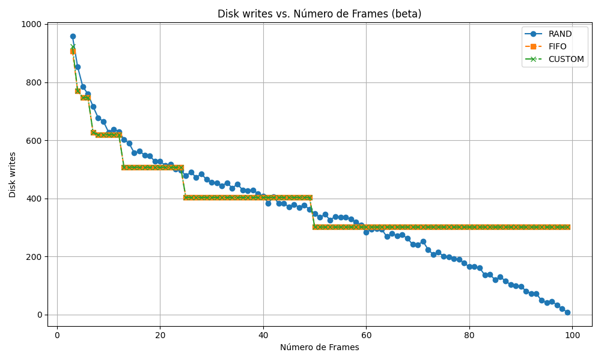

# Relatório do Trabalho 2 - Memória Virtual Paginada Sob Demanda
- Davi Ludvig,
- João Paulo Oliveira e
- Gibram Goulart.

## Introdução
Este documento reúne um apanhado de informações acerca da solução dos discentes autores para resolver o enunciado do trabalho 2 da disciplina INE5412.

### 1. Objetivo
O objetivo deste trabalho é implementar um sistema de memória virtual paginada sob demanda em espaço de usuário, compreendendo a mecânica do tratamento de faltas de página e avaliando o desempenho de diferentes algoritmos de substituição de páginas (FIFO, RANDOM e um algoritmo personalizado). A implementação foi baseada no projeto do Prof. Douglas Thain (Universidade de Notre Dame), adaptado para o ambiente proposto em aula e disponibilizado pelo professor Giovani Gracioli.

### 2. Ambiente Experimental

- **Máquina utilizada**:  
  - Sistema Operacional: Ubuntu 24.04 LTS
  - Compilador: g++ (Ubuntu 13.3.0-6ubuntu2~24.04) 13.3.0
  - Make: GNU Make 4.3 compilado para x86_64-pc-linux-gnu

- **Execução dos testes**:  
Para cada programa (`alpha`, `beta`, `gamma`, `delta`), os seguintes comandos podem ser executados com variações:

  ```bash
  ./virtmem 10 10 rand alpha
  ./virtmem 10 10 fifo beta
  ./virtmem 10 10 custom gamma
  ...
  ```

### 3 Arquitetura
#### 3.1 Estrutura Básica
O projeto foi dividido nas seguintes classes:

- `Page_Table`: Interface com a tabela de páginas. Gerencia o mapeamento entre páginas virtuais e frames físicos e captura falhas de página usando um tratador de sinais (`SIGSEGV`).
- `Disk`: Simulação de um disco secundário, fornecendo operações de leitura e escrita em blocos.
- `Page_Replacement`: Gerencia o estado dos frames físicos (livres/ocupados) e implementa a lógica para os algoritmos de substituição de páginas quando ocorrem falhas de página.
- `Program`: Classe responsável por gerenciar os programas utilizados nas execuções (`alpha`, `beta`, `gamma` e `delta`). Ela coordena o fluxo das instruções, realiza acessos à memória virtual e simula os diferentes padrões de uso de memória definidos para os testes.

A classe `Page_Replacement` utiliza estruturas de dados auxiliares para implementar os algoritmos. O `std::vector<int> frame_table` monitora qual página ocupa cada frame, atendendo ao requisito de gerenciar os frames livres. Para o algoritmo FIFO, a `std::queue<int> fifo_queue` mantém a ordem de entrada das páginas. Já o algoritmo `custom` (LRU) utiliza p `std::vector<int> tempo_acesso` para registrar o tempo do último acesso a cada frame.

#### 3.2 Como executar o sistema
Foi construído um arquivo `Makefile` para facilitar a compilação e execução do sistema. Para compilar o sistema, basta executar o comando na raiz do projeto (onde está localizado o arquivo `Makefile`):

```bash
make
```

Depois disso, o executável `virtmem` estará disponível na raiz do projeto. Para executar o sistema, utilize o seguinte comando:

```bash
./virtmem <número de frames> <número de páginas> <algoritmo de substituição> <programa>
```

> Todos os objetos `.o` estão localizados na pasta `build`, e o executável `virtmem` está localizado na raiz do projeto.

#### 3.3 Funcionamento do Tratador de Page Faults:
##### Passos:

1. Uma falta de página (*segmentation fault*) é detectada pelo sistema operacional, que aciona o tratador de sinais (`internal_fault_handler`) configurado pela classe `Page_Table`.
2. O tratador delega a responsabilidade para a instância da classe `Page_Replacement`, que incrementa as estatísticas de falhas de página.
3. Verifica-se se há um frame de memória física livre:
    - Se houver, a página correspondente é lida do disco para o frame livre.
    - Se não houver, o algoritmo de substituição de página selecionado é acionado para escolher uma página "vítima" a ser removida da memória.
        - Se a página vítima foi modificada (sinalizada com permissão de escrita), ela é escrita de volta no disco para salvar as alterações.
        - O frame é liberado, e a entrada da página vítima na tabela de páginas é invalidada.
4. A nova página requisitada é carregada do disco para o frame recém-liberado.
5. A entrada na tabela de páginas é atualizada para mapear a página ao seu novo frame, com permissão inicial de apenas leitura (`PROT_READ`).
6. Se o algoritmo for FIFO, a página é adicionada ao final da fila. Se for LRU (custom), o seu tempo de acesso é registrado.
7. Se a falta de página ocorreu por uma tentativa de escrita em uma página que já está na memória (com permissão de apenas leitura), o bit de escrita (`PROT_WRITE`) é ativado, sem a necessidade de acessar o disco.


> Estatísticas de execução (page faults, disk reads/writes) são coletadas automaticamente para análise de desempenho.

#### 3.4 Diagramas
##### 3.4.1 Diagrama de classes

TODO FILL

##### 3.4.2 Fluxo


### 4. Algoritmos de Substituição de Página

#### 4.1. RANDOM

Seleciona aleatoriamente um frame para substituição. A implementação utiliza `std::rand() % frame_table.size()` para escolher o frame a ser desocupado, tornando o processo não determinístico em relação ao histórico de acessos.

#### 4.2. FIFO (First-In, First-Out)

Mantém uma fila (`std::queue`) das páginas carregadas na memória. Quando uma substituição é necessária, a página que está na frente da fila (a que foi carregada há mais tempo) é removida.

#### 4.3 CUSTOM

- Como algoritmo personalizado `custom` construído pelo grupo, foi decidido implementar uma versão do algoritmo de substituição de páginas **LRU (Least Recently Used)**.
- Na inicialização da classe `Page_Replacement`, são definidos dois atributos:
1. O vetor de inteiros `tempo_acesso`, que armazena o "tempo" do último acesso de cada frame.
2. O inteiro `tempo_atual`, que é incrementado a cada vez que uma falha de página é tratada, servindo como um relógio lógico.
- Dentro do método `Page_Replacement::select_frame_to_be_removed`, ao checar que o algoritmo é `custom`, os seguintes passos são aplicados:
1. Define o tempo mínimo como o maior inteiro possível.
2. Define o frame a ser removido como -1. (Nenhum frame)
3. Para cada frame, faça
   1. Se o tempo de acesso do frame for menor que o tempo mínimo, defina que o índice frame a ser removido é o atual.
4. Retorne o índice do frame a ser removido.

- O tempo de acesso de um frame é atualizado sempre que a página contida nele é referenciada, seja por uma falta de página que carrega dados ou por uma falta de permissão que concede direito de escrita.

#### 4.3.1 Comparações
##### Rand
- O algoritmo `rand` seleciona um frame aleatoriamente para remoção, o que pode levar a uma alta taxa de faltas de página, especialmente em cenários onde as páginas acessadas recentemente são necessárias novamente.
- Nesse cenário, existirão diversas possibilidades do `custom` se sair melhor que o `rand`, pois o `custom` prioriza a remoção de páginas que não foram acessadas recentemente, enquanto o `rand` não considera o histórico de acesso.

##### FIFO
- O algoritmo `fifo` remove a página que foi carregada há mais tempo, o que pode levar a uma taxa de faltas de página alta se as páginas acessadas recentemente forem removidas (**Anomalia de Belady**).
- O `custom` (**LRU**) pode se sair melhor que o `fifo` em cenários onde as páginas acessadas recentemente são necessárias novamente, pois o `custom` prioriza a remoção de páginas que não foram acessadas recentemente.
- Além disso, em cenários onde há uma alta taxa de acesso a páginas, o `custom` pode se sair melhor que o `fifo`, pois o `fifo` não considera o histórico de acesso das páginas, enquanto o `custom` prioriza a remoção de páginas que não foram acessadas recentemente. Isso pode ser perceptível também em cenários com bastante leitura.

##### Gráfico para entendimento
- Foi constrúido o seguinte diagrama gráfico para melhor entendimento do algoritmo `custom`:


Primeiro, alocou-se ambos vetores que representam o `frame` e o `tempo_acesso` para cada frame (`n`). O vetor de frames inicia com todos os valores iguais a -1, indicando que nenhum frame está ocupado. O vetor de `tempo_acesso` inicia com todos os valores iguais a 0, indicando que nenhum frame foi acessado.

Em seguida, são requisitadas as páginas `0`, `1`, `2`, ..., `n-1`, que ocupam todos os frames disponíveis. A cada requisição, o tempo atual é incrementado e o tempo de acesso do frame correspondente é atualizado para o valor do tempo atual.

Após isso, a página `1` é requisitada novamente, o que atualiza o tempo de acesso do frame correspondente para o valor do tempo atual (`n+1`).

Depois da requisição da página `1`, as páginas `n` e `n+1` são requisitadas. Como não há frames disponíveis, o algoritmo `custom` seleciona o frame com o menor tempo de acesso, que é o frame da página `0`, e o substitui pela página `n`. E o frame que alocava a página `2` é substituído pela página `n+1`, pois o tempo de acesso do frame da página `2` é o menor dentre os disponíveis no momento.

Com isso, observamos que o algoritmo `custom` (LRU) remove sempre a página que está há mais tempo sem ser acessada, o que pode levar a uma taxa de faltas de página menor em cenários onde as páginas acessadas recentemente são necessárias novamente.

É perceptível que, neste caso, o algoritmo `custom` se sai melhor que o `rand` e o `fifo`, pois ele prioriza a remoção de páginas que não foram acessadas recentemente. Se fosse o caso de utilizar `fifo`, no tempo `n+3`, a página `1` seria removida, o que não é o ideal, pois ela foi acessada recentemente. Já o `rand` poderia remover qualquer página, sem considerar o histórico de acesso.

### 5. Resultados e Análises
A seguir, serão listados, para cada programa (`alpha`, `beta`, `gamma` e `delta`), uma sequência de gráficos que mostram os valores de `page faults`, `disk reads` e `disk writes` para cada algoritmo de substituição de página (`rand`, `fifo` e `custom`).

Para contextualizar os resultados, é importante entender o padrão de acesso à memória de cada programa de teste, conforme fornecido no projeto:Add commentMore actions
- **Alpha:** Realiza acessos sequenciais em grandes blocos de memória.
- **Beta:** Ordena um grande vetor de dados, resultando em acessos complexos e não totalmente sequenciais.
- **Gamma:** Acessa de forma cíclica e repetida dois grandes vetores, caracterizando um padrão com forte localidade temporal em escala macro.
- **Delta:** Efetua um grande número de trocas de dados em posições aleatórias, simulando um cenário de pior caso sem localidade.

A análise a seguir detalha o comportamento dos algoritmos de substituição de página (RAND, FIFO e CUSTOM) para cada programa de teste, com base nos dados de faltas de página, leituras de disco e escritas em disco.

Os seguintes testes foram da seguinte forma
```bash
./virtmem <list(range(3, 100))> 100 <["rand", "fifo", "custom"]> <["alpha", "beta", "gamma", "delta"]>
```

Ou seja, para cada programa (`alpha`, `beta`, `gamma`, `delta`), foram testados os algoritmos de substituição de página (`rand`, `fifo` e `custom`) com um número de frames variando de 3 a 100 e fixamente com 100 páginas. Os resultados foram coletados e organizados em gráficos para análise.

> Cabe destacar que todos os testes de aleatoriedade foram executados com a semente de aleatoriedade `srand(0)`, para garantir a reprodutibilidade dos resultados.

#### 5.1 Resultados dos testes

##### 5.1.1 Alpha
O programa `alpha` acessa a memória de forma sequencial em blocos. Essa característica leva a um comportamento distinto nos algoritmos de substituição.

- **Faltas de Página:** Os algoritmos FIFO e CUSTOM apresentam um número de falhas de página que cai drasticamente para um valor constante e baixo quando o número de frames é suficiente para conter o `chunksize` do programa (aproximadamente 10 frames). Em contraste, o algoritmo RAND mostra uma redução gradual, mas consistentemente mais elevada de falhas em comparação com os outros dois após o ponto de inflexão.
- **Leituras e Escritas de Disco:** O padrão de leituras e escritas no disco segue o mesmo comportamento das faltas de página. Há uma queda acentuada para FIFO e CUSTOM, que se estabilizam em um patamar baixo, enquanto RAND decai de forma mais lenta.

A performance idêntica entre FIFO e CUSTOM (LRU) sugere que o padrão de acesso sequencial do `alpha` não oferece oportunidades para o LRU explorar a localidade temporal. A página menos recentemente usada é sempre a primeira que entrou, tornando os dois algoritmos equivalentes nesse cenário.Add commentMore actions


##### 5.1.2 Beta
O programa `beta` executa uma ordenação (`qsort`), resultando em um padrão de acesso à memória complexo e menos previsível.

- **Faltas de Página:** Todos os algoritmos mostram uma tendência decrescente no número de falhas de página à medida que mais frames são disponibilizados. Os algoritmos FIFO e CUSTOM são novamente idênticos, apresentando um declínio em "degraus", onde a performance se estabiliza por um intervalo de frames antes de cair novamente. RAND segue a tendência geral, mas de forma mais irregular.Add commentMore actions
- **Leituras e Escritas de Disco:** Os gráficos de leituras e escritas espelham o comportamento das faltas de página, com a mesma tendência decrescente em degraus para FIFO e CUSTOM.

O padrão de "escada" indica que o desempenho melhora em saltos discretos, provavelmente quando o número de frames se torna suficiente para acomodar partições inteiras dos dados durante o processo de ordenação. A falta de vantagem do CUSTOM sobre o FIFO sugere que, embora o acesso não seja puramente sequencial, o padrão de referência às páginas é tão disperso que a localidade temporal não é explorada.





##### 5.1.3 Gamma
O programa `gamma` computa o produto escalar entre dois grandes vetores repetidamente.

**Faltas de Página, Leituras e Escritas de Disco:** Os gráficos mostram que os algoritmos FIFO e CUSTOM têm um desempenho idêntico e constante, independentemente do número de frames. Em contrapartida, o algoritmo RAND melhora de forma consistente à medida que mais frames são adicionados.

A performance constante de FIFO e CUSTOM é um exemplo clássico de "thrashing". Adicionar mais frames não resolve o problema, pois o padrão de remoção sistemática continua. O algoritmo RAND, por sua natureza aleatória, consegue quebrar esse ciclo.


##### 5.1.4 Delta
O programa `delta` realiza um grande número de trocas em locais aleatórios da memória, simulando um cenário de pior caso com baixa ou nenhuma localidade.

- **Faltas de Página, Leituras e Escritas de Disco:** Nos três gráficos, todos os algoritmos (RAND, FIFO e CUSTOM) apresentam um desempenho quase idêntico. As curvas mostram uma queda quase perfeitamente linear à medida que o número de frames aumenta. A única pequena exceção é que o RAND tem um número de leituras de disco ligeiramente maior com poucos frames, mas converge rapidamente com os outros.

Esse comportamento demonstra que, na ausência de localidade, o algoritmo de substituição de página se torna irrelevante. A probabilidade de acessar qualquer página é a mesma, então a escolha de qual página "vítima" remover (a mais antiga, a menos usada ou uma aleatória) não impacta o resultado final. A queda linear é esperada: com mais frames, a chance de uma página aleatoriamente acessada estar na memória aumenta proporcionalmente, reduzindo as faltas de página de forma linear.


#### 5.2 Análise dos resultados

##### 5.2.1 Valores iguais de `fifo` e `custom`
Ambos os algoritmos `fifo` e `custom` se comportam de maneira semelhante quando
1. As páginas não são reutilizadas dentro do espaço de frames disponíveis.
2. As páginas são acessadas em um padrão sequencial e uniforme.

Ou seja, não há reaproveitamento de páginas antes que elas sejam substituídas. Quando isso acontece, tanto `fifo` quanto `custom`
- Inserem a nova página no primeiro frame livre;
- Quando os frames estão cheios, removem a “mais antiga”:
  - `fifo` remove a página que entrou primeiro;
  - `custom` remove a página que não foi acessada há mais tempo.
- Quando não há solicitações de reutilização de páginas, ambos os algoritmos apresentam o mesmo desempenho, pois não há diferença entre remover a página mais antiga ou a menos recentemente usada.

Ou seja, os programas `alpha`, `beta`, `gamma` e `delta` não apresentam reutilização antes da substituição, não favorecem localidade temporal e, portanto, não se beneficiam de um algoritmo mais sofisticado como o `custom`.

##### 5.2.2 Caráter num geral ser descendente
Os gráficos de `disk reads`, `disk writes` e `page faults` tendem a ser descendentes, pois:
1. À medida que o número de frames aumenta, mais páginas podem ser mantidas na memória, reduzindo a necessidade de leituras e escritas no disco.
2. Com mais frames, o número de faltas de página diminui, pois mais páginas podem ser mantidas na memória, reduzindo a necessidade de leituras e escritas no disco.
3. O aumento do número de frames permite que mais páginas sejam mantidas na memória, reduzindo a necessidade de substituições e, consequentemente, o número de faltas de página.

##### 5.2.3 Comportamento constante do `gamma` com `fifo` e `custom`
O programa `gamma` apresenta um padrão constante em relação ao número de frames, tanto para `fifo` quanto para `custom`. Isso ocorre porque o programa `gamma` acessa dois grandes vetores de forma sequencial e simétrica, realizando operações de produto escalar em iterações completas. Esse padrão resulta em um comportamento previsível de falta de páginas:
1. Todas as páginas dos vetores são acessadas em sequência várias vezes. Isso gera um padrão de substituições que se repete de forma estável à medida que o número de frames aumenta.
2. Como todas as páginas são usadas com a mesma frequência e espaçamento, não há uma vantagem clara em preservar as páginas mais recentemente acessadas, o que anula a diferença entre `fifo` e `custom` (já discutido anteriormente).

Isso já não acontece com o `rand` porque o algoritmo escolhe aleatoriamente qual página remover da memória sempre que ocorre uma falta de página e não há frame livre. Dessa forma, o `rand` não apresenta um padrão constante, mas sim descendente, pois o número de frames aumenta e, consequentemente, o número de faltas de página diminui.

##### 5.2.4 Comportamento linear descendente de `delta`
Seja com qualquer algoritmo de substituição de página, o programa `delta` apresenta, num geral, um comportamento linear descendente (em `rand` é perceptível uma tendência) para leituras de disco, escritas de disco e faltas de página. Isso ocorre porque os acessos do programa são feitos de forma aleatória, sendo altamente dispersos e com baixíssima reutilização.

Dessa forma, à medida que o número de frames aumenta, mais páginas podem ser mantidas na memória - reduzindo a chance de substituições. 

Ou seja, num geral, a tendência dos gráficos é de serem descendentes, mas pelo comportamento dos programas, acontece de não serem lineares. Porém, como o `delta` é extremamente disperso, ele apresenta o "pior" caso, que é o comportamento linear descendente.

##### 5.2.5 Tempo de execução
Cabe destacar que o tempo de execução do programa `delta` é significativamente maior que o dos outros programas, devido à sua natureza de acessos aleatórios e dispersos. Isso resulta em um número elevado de faltas de página e, consequentemente, em mais leituras e escritas no disco.

Isso pode ser perceptível no seguinte gráfico que compara o tempo de execução dos programas:


## Apêndice
### Vazamento de memória
Durante toda a implementação do sistema, foram constantemente verificados os vazamentos de memória, utilizando o Valgrind, para garantir que não existam vazamentos no código final. A alocação dinâmica de memória é corretamente liberada com `delete[]` em seus respectivos destrutores ou métodos de limpeza. O objeto `Disk` é explicitamente deletado em `main.cpp`. A seguir, um exemplo de execução do Valgrind:

```bash
valgrind ./virtmem 10 10 rand alpha --leak-check=full
```

Que obteve o seguinte retorno:

```
==375405== Memcheck, a memory error detectorAdd commentMore actions
==375405== Copyright (C) 2002-2022, and GNU GPL'd, by Julian Seward et al.
==375405== Using Valgrind-3.22.0 and LibVEX; rerun with -h for copyright info
==375405== Command: ./virtmem 10 10 rand alpha --leak-check=full
==375405== 
use: virtmem <npages> <nframes> <rand|fifo|custom> <alpha|beta|gamma|delta>
==375405== 
==375405== HEAP SUMMARY:
==375405==     in use at exit: 0 bytes in 0 blocks
==375405==   total heap usage: 2 allocs, 2 frees, 74,752 bytes allocated
==375405== 
==375405== All heap blocks were freed -- no leaks are possible
==375405== 
==375405== For lists of detected and suppressed errors, rerun with: -s
==375405== ERROR SUMMARY: 0 errors from 0 contexts (suppressed: 0 from 0)
```

Ou seja, não foram encontrados vazamentos de memória durante a execução do sistema e todas as alocações de memória foram devidamente liberadas.

