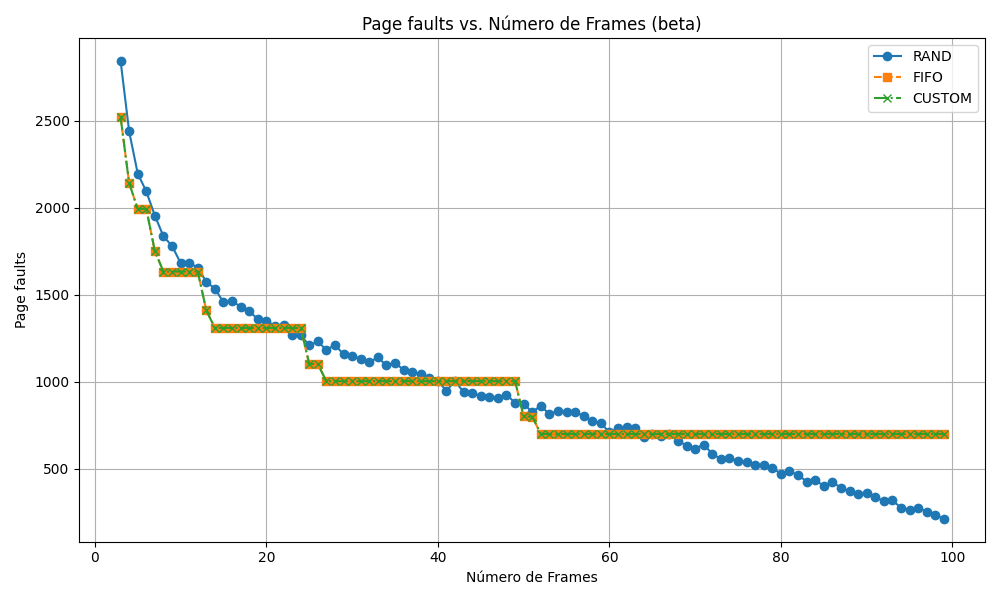

# Relatório do Trabalho 2 - Memória Virtual Paginada Sob Demanda
- Davi Ludvig,
- João Paulo Oliveira e
- Gibram Goulart.

## Introdução
Este documento reúne um apanhado de informações acerca da solução dos discentes autores para resolver o enunciado do trabalho 2 da disciplina INE5412.

### 1. Objetivo
O objetivo deste trabalho é implementar um sistema de memória virtual paginada sob demanda em espaço de usuário, compreendendo a mecânica do tratamento de faltas de página e avaliando o desempenho de diferentes algoritmos de substituição de páginas (FIFO, RANDOM e um algoritmo personalizado). A implementação foi baseada no projeto do Prof. Douglas Thain (Universidade de Notre Dame), adaptado para o ambiente proposto em aula e disponibilizado pelo professor Giovani Gracioli.

### 2. Ambiente Experimental

- **Máquina utilizada**:  
  - Sistema Operacional: Ubuntu 24.04 LTS
  - Compilador: g++ (Ubuntu 13.3.0-6ubuntu2~24.04) 13.3.0
  - Make: GNU Make 4.3 compilado para x86_64-pc-linux-gnu

- **Execução dos testes**:  
Para cada programa (`alpha`, `beta`, `gamma`, `delta`), os seguintes comandos podem ser executados com variações:

  ```bash
  ./virtmem 10 10 rand alpha
  ./virtmem 10 10 fifo beta
  ./virtmem 10 10 custom gamma
  ...
  ```

### 3 Arquitetura
#### 3.1 Estrutura Basica
O projeto foi dividido nas seguintes classes:

- `Page_Table`: Interface com a tabela de páginas.
- `Disk`: Simulação de um disco secundário.
- `Page_Replacement`: Gerencia o estado dos frames físicos (livres/ocupados) e realiza as substituições de páginas.
- `Program`: Classe responsável por gerenciar os programas utilizados nas execuções (`alpha`, `beta`, `gamma` e `delta`). Ela coordena o fluxo das instruções, realiza acessos à memória virtual e simula os diferentes padrões de uso de memória definidos para os testes.

#### 3.2 Como executar o sistema
Foi construído um arquivo `Makefile` para facilitar a compilação e execução do sistema. Para compilar o sistema, basta executar o comando na raiz do projeto (onde está localizado o arquivo `Makefile`):

```bash
make
```

Depois disso, o executável `virtmem` estará disponível na raiz do projeto. Para executar o sistema, utilize o seguinte comando:

```bash
./virtmem <número de frames> <número de páginas> <algoritmo de substituição> <programa>
```

> Todos os objetos `.o` estão localizados na pasta `build`, e o executável `virtmem` está localizado na raiz do projeto.

#### 3.3 Funcionamento do Tratador de Page Faults:
##### Passos:
1. Detecta a falta de página.
2. Se for a primeira falta, inicializa os frames.
3. Verifica por um frame livre:
   - Se disponível, lê a página do disco.
   - Se não, aplica o algoritmo de substituição:
     - Se a página vítima foi modificada, escreve-a no disco.
     - Libera o frame e invalida a entrada anterior.
4. Carrega a nova página no frame.
5. Atualiza a entrada na tabela de páginas.
6. Caso seja FIFO, adiciona à fila.
7. Se já estiver na memória mas com permissão insuficiente, ativa o bit de escrita.
> Estatísticas de execução (page faults, disk reads/writes) são coletadas automaticamente.


#### 3.4 Diagrama de Classes

### 4. Algoritmos de Substituição de Página

#### 4.1. RANDOM

Seleciona aleatoriamente uma página para substituição.

#### 4.2. FIFO (First-In, First-Out)

Mantém uma fila das páginas carregadas. A página mais antiga (a que entrou primeiro) é removida.


#### 4.3 CUSTOM

- Como algoritmo personalizado `custom` construído pelo grupo, foi decidido implementar uma versão do algoritmo de substituição de páginas **LRU (Least Recently Used)**.
- Na inicialização da classe `Page_Replacement`, são definidos dois atributos:
1. O vetor de inteiros `tempo_acesso`, que armazena o tempo do último acesso de cada frame.
2. O inteiro `tempo_atual`, que é incrementado a cada vez que uma página é acessada, servindo como um contador de tempo global.
- Dentro do método `Page_Replacement::select_frame_to_be_removed`, é feita a checagem do algoritmo. Se for custom, aplica os seguintes passos:
1. Define o tempo mínimo como o maior inteiro possível.
2. Define o frame a ser removido como -1. (Nenhum frame)
3. Para cada frame, faça
   1. Se o tempo de acesso do frame for menor que o tempo mínimo, defina que o frame a ser removido é o atual.
4. Retorne o frame a ser removido.

#### 4.3.1 Comparações
##### Rand
- O algoritmo `rand` seleciona um frame aleatoriamente para remoção, o que pode levar a uma alta taxa de faltas de página, especialmente em cenários onde as páginas acessadas recentemente são necessárias novamente.
- Nesse cenário, existirão diversas possibilidades do `custom` se sair melhor que o `rand`, pois o `custom` prioriza a remoção de páginas que não foram acessadas recentemente, enquanto o `rand` não considera o histórico de acesso.

##### FIFO
- O algoritmo `fifo` remove a página que foi carregada há mais tempo, o que pode levar a uma taxa de faltas de página alta se as páginas acessadas recentemente forem removidas.
- O `custom` pode se sair melhor que o `fifo` em cenários onde as páginas acessadas recentemente são necessárias novamente, pois o `custom` prioriza a remoção de páginas que não foram acessadas recentemente.
- Além disso, em cenários onde há uma alta taxa de acesso a páginas, o `custom` pode se sair melhor que o `fifo`, pois o `fifo` não considera o histórico de acesso das páginas, enquanto o `custom` prioriza a remoção de páginas que não foram acessadas recentemente. Isso pode ser perceptível também em cenários com bastante leitura.

##### Gráfico para entendimento
- Foi constrúido o seguinte diagrama gráfico para melhor entendimento do algoritmo `custom`:


Primeiro, alocou-se ambos vetores que representam o `frame` e o `tempo_acesso` para cada frame (`n`). O vetor de frames inicia com todos os valores iguais a -1, indicando que nenhum frame está ocupado. O vetor de `tempo_acesso` inicia com todos os valores iguais a 0, indicando que nenhum frame foi acessado.

Em seguida, são requisitadas as páginas `0`, `1`, `2`, ..., `n-1`, que ocupam todos os frames disponíveis. A cada requisição, o tempo atual é incrementado e o tempo de acesso do frame correspondente é atualizado para o valor do tempo atual.

Após isso, a página `1` é requisitada novamente, o que atualiza o tempo de acesso do frame correspondente para o valor do tempo atual (`n+1`).

Depois da requisição da página `1`, as páginas `n` e `n+1` são requisitadas. Como não há frames disponíveis, o algoritmo `custom` seleciona o frame com o menor tempo de acesso, que é o frame da página `0`, e o substitui pela página `n`. E o frame que alocava a página `2` é substituído pela página `n+1`, pois o tempo de acesso do frame da página `2` é o menor dentre os disponíveis no momento.

Com isso, observamos que o algoritmo `custom` (LRU) remove sempre a página que está há mais tempo sem ser acessada, o que pode levar a uma taxa de faltas de página menor em cenários onde as páginas acessadas recentemente são necessárias novamente.

É perceptível que, neste caso, o algoritmo `custom` se sai melhor que o `rand` e o `fifo`, pois ele prioriza a remoção de páginas que não foram acessadas recentemente. Se fosse o caso de utilizar `fifo`, no tempo `n+3`, a página `1` seria removida, o que não é o ideal, pois ela foi acessada recentemente. Já o `rand` poderia remover qualquer página, sem considerar o histórico de acesso.

### 5. Resultados e Análises
A seguir, serão listados, para cada programa (`alpha`, `beta`, `gamma` e `delta`), uma sequência de gráficos que mostram os valores de `page faults`, `disk reads` e `disk writes` para cada algoritmo de substituição de página (`rand`, `fifo` e `custom`).

> Cabe destacar que todos os testes de aleatoriedade foram executados com a semente de aleatoriedade `srand(0)`, para garantir a reprodutibilidade dos resultados.

#### Resultados dos testes

##### 5.1 Alpha
- O comportamento de `alpha` é caracterizado por acessos sequenciais a páginas, o que causa muitas faltas de página, especialmente quando o número de frames é baixo. 
- Esse comportamento pode ser visto nos seguintes gráficos:

###### Leituras de disco


###### Escritas de disco


###### Faltas de página


##### 5.2 Beta

###### Leituras de disco


###### Escritas de disco


###### Faltas de página


##### 5.3 Gamma

###### Leituras de disco


###### Escritas de disco


###### Faltas de página


##### 5.4 Delta

###### Leituras de disco


###### Escritas de disco


###### Faltas de página


#### Análise dos resultados

##### Valores iguais de `fifo` e `custom`
Ambos os algoritmos `fifo` e `custom` se comportam de maneira semelhante quando
1. As páginas não são reutilizadas dentro do espaço de frames disponíveis.
2. As páginas são acessadas em um padrão sequencial e uniforme.

Ou seja, não há reaproveitamento de páginas antes que elas sejam substituídas. Quando isso acontece, tanto `fifo` quanto `custom`
- Inserem a nova página no primeiro frame livre;
- Quando os frames estão cheios, removem a “mais antiga”:
  - `fifo` remove a página que entrou primeiro;
  - `custom` remove a página que não foi acessada há mais tempo.
- Quando não há solicitações de reutilização de páginas, ambos os algoritmos apresentam o mesmo desempenho, pois não há diferença entre remover a página mais antiga ou a menos recentemente usada.

Ou seja, os programas `alpha`, `beta`, `gamma` e `delta` não apresentam reutilização antes da substituição, não favorecem localidade temporal e, portanto, não se beneficiam de um algoritmo mais sofisticado como o `custom`.

##### Caráter num geral ser descendente
Os gráficos de `disk reads`, `disk writes` e `page faults` tendem a ser descendentes, pois:
1. À medida que o número de frames aumenta, mais páginas podem ser mantidas na memória, reduzindo a necessidade de leituras e escritas no disco.
2. Com mais frames, o número de faltas de página diminui, pois mais páginas podem ser mantidas na memória, reduzindo a necessidade de leituras e escritas no disco.
3. O aumento do número de frames permite que mais páginas sejam mantidas na memória, reduzindo a necessidade de substituições e, consequentemente, o número de faltas de página.

##### Comportamento constante do `gamma` com `fifo` e `custom`
O programa `gamma` apresenta um padrão constante em relação ao número de frames, tanto para `fifo` quanto para `custom`. Isso ocorre porque o programa `gamma` acessa dois grandes vetores de forma sequencial e simétrica, realizando operações de produto escalar em iterações completas. Esse padrão resulta em um comportamento previsível de falta de páginas:
1. Todas as páginas dos vetores são acessadas em sequência várias vezes. Isso gera um padrão de substituições que se repete de forma estável à medida que o número de frames aumenta.
2. Como todas as páginas são usadas com a mesma frequência e espaçamento, não há uma vantagem clara em preservar as páginas mais recentemente acessadas, o que anula a diferença entre `fifo` e `custom` (já discutido anteriormente).

Isso já não acontece com o `rand` porque o algoritmo escolhe aleatoriamente qual página remover da memória sempre que ocorre uma falta de página e não há frame livre. Dessa forma, o `rand` não apresenta um padrão constante, mas sim descendente, pois o número de frames aumenta e, consequentemente, o número de faltas de página diminui.

##### Comportamento linear descendente de `delta`
Seja com qualquer algoritmo de substituição de página, o programa `delta` apresenta, num geral, um comportamento linear descendente (em `rand` é perceptível uma tendência) para leituras de disco, escritas de disco e faltas de página. Isso ocorre porque os acessos do programa são feitos de forma aleatória, sendo altamente dispersos e com baixíssima reutilização.

Dessa forma, à medida que o número de frames aumenta, mais páginas podem ser mantidas na memória - reduzindo a chance de substituições. 

Ou seja, num geral, a tendência dos gráficos é de serem descendentes, mas pelo comportamento dos programas, acontece de não serem lineares. Porém, como o `delta` é extremamente disperso, ele apresenta o "pior" caso, que é o comportamento linear descendente.

##### Tempo de execução
Cabe destacar que o tempo de execução do programa `delta` é significativamente maior que o dos outros programas, devido à sua natureza de acessos aleatórios e dispersos. Isso resulta em um número elevado de faltas de página e, consequentemente, em mais leituras e escritas no disco.

Isso pode ser perceptível no seguinte gráfico que compara o tempo de execução dos programas:


## Apêndice
### Vazamento de memória
Durante toda a implementação do sistema, foram constantemente verificados os vazamentos de memória, utilizando o Valgrind. Dessa forma, foi possível garantir que não existam vazamentos de memória no código final. A seguir, um exemplo de execução do Valgrind:

```bash
valgrind ./virtmem 10 10 rand alpha --leak-check=full
```

Que retorna o seguinte `HEAP SUMMARY`:

```
==815761== 
==815761== HEAP SUMMARY:
==815761==     in use at exit: 0 bytes in 0 blocks
==815761==   total heap usage: 4 allocs, 4 frees, 75,328 bytes allocated
==815761== 
==815761== All heap blocks were freed -- no leaks are possible
==815761== 
==815761== For lists of detected and suppressed errors, rerun with: -s
==815761== ERROR SUMMARY: 0 errors from 0 contexts (suppressed: 0 from 0)
```

Ou seja, não foram encontrados vazamentos de memória durante a execução do sistema e todas as alocações de memória foram devidamente liberadas.

