# Report – Assignment 2: Demand-Paged Virtual Memory System
* Davi Ludvig Longen Machado (23100473), 
* João Paulo Oliveira Melo (23204880) e
*  Gibram Goulart Farias (20200402).

## Sumário

- [Report – Assignment 2: Demand-Paged Virtual Memory System](#report--assignment-2-demand-paged-virtual-memory-system)
  - [Sumário](#sumário)
  - [Introduction](#introduction)
    - [1. Objective](#1-objective)
    - [2. Experimental Environment](#2-experimental-environment)
    - [3 Architecture](#3-architecture)
      - [3.1 Basic Structure](#31-basic-structure)
      - [3.2 How to Run the System](#32-how-to-run-the-system)
      - [3.3 Page Fault Handler Operation:](#33-page-fault-handler-operation)
      - [3.4 Diagrams](#34-diagrams)
        - [3.4.1 Class Diagram](#341-class-diagram)
        - [3.4.2 Flow Diagram](#342-flow-diagram)
    - [4. Page Replacement Algorithms](#4-page-replacement-algorithms)
      - [4.1. RANDOM](#41-random)
      - [4.2 FIFO (First-In, First-Out)](#42-fifo-first-in-first-out)
      - [4.3 CUSTOM](#43-custom)
      - [4.3.1 Comparisons](#431-comparisons)
        - [Rand](#rand)
        - [FIFO](#fifo)
        - [Diagram for Understanding](#diagram-for-understanding)
    - [5. Results and Analysis](#5-results-and-analysis)
      - [5.1 Testing each program](#51-testing-each-program)
        - [5.1.1 Alpha](#511-alpha)
        - [5.1.2 Beta](#512-beta)
        - [5.1.3 Gamma](#513-gamma)
        - [5.1.4 Delta](#514-delta)
      - [5.2 Analysis of the Results](#52-analysis-of-the-results)
        - [5.2.1 Similarities Between `fifo` and `custom`](#521-similarities-between-fifo-and-custom)
        - [5.2.2 General Downward Trend](#522-general-downward-trend)
        - [5.2.3 Constant Behavior of `gamma` with `fifo` and `custom`](#523-constant-behavior-of-gamma-with-fifo-and-custom)
        - [5.2.4 Linear Behavior of `delta`](#524-linear-behavior-of-delta)
        - [5.2.5 Execution time](#525-execution-time)
  - [Appendix](#appendix)
    - [Memory Leak](#memory-leak)
    - [Specific Results Expected](#specific-results-expected)
  - [Conclusion](#conclusion)

## Introduction

This document presents a detailed overview of the solution developed by the student authors to address Assignment 2 of the INE5412 Operating Systems course.

### 1. Objective

The goal of this project is to implement a **user-space demand-paged virtual memory system**, understanding the mechanics of page fault handling and evaluating the performance of different page replacement algorithms (FIFO, RANDOM, and a custom one). The implementation is based on the project by Prof. Douglas Thain (University of Notre Dame), adapted for the classroom environment and provided by Professor Giovani Gracioli.

### 2. Experimental Environment

* **Machine used**:

  * Operating System: Ubuntu 24.04 LTS
  * Compiler: g++ (Ubuntu 13.3.0-6ubuntu2\~24.04) 13.3.0
  * Make: GNU Make 4.3 compiled for x86\_64-pc-linux-gnu

* **Test execution**:
  For each program (`alpha`, `beta`, `gamma`, `delta`), the following commands were executed with variations:

```bash
./virtmem 10 10 rand alpha
./virtmem 10 10 fifo beta
./virtmem 10 10 custom gamma
...
```

### 3 Architecture

#### 3.1 Basic Structure

The project is organized into the following classes:

* **`Page_Table`**: Acts as the interface to the page table. It manages the mapping between virtual pages and physical frames and handles page faults using a signal handler (`SIGSEGV`).
* **`Disk`**: Simulates a secondary disk, providing read and write operations on data blocks.
* **`Page_Replacement`**: Manages the state of physical memory frames (free/occupied) and implements the logic for page replacement algorithms when faults occur.
* **`Program`**: Manages the execution of the test programs (`alpha`, `beta`, `gamma`, and `delta`). It controls the instruction flow, performs accesses to virtual memory, and simulates different memory access patterns for each test case.

The `Page_Replacement` class uses auxiliary data structures to implement the algorithms:

* A `std::vector<int> frame_table` tracks which page occupies each frame, fulfilling the requirement of managing free frames.
* For the FIFO algorithm, a `std::queue<int> fifo_queue` maintains the insertion order of pages.
* For the `custom` (LRU) algorithm, a `std::vector<int> tempo_acesso` stores the last access time of each frame.


#### 3.2 How to Run the System

A `Makefile` was created to simplify the compilation and execution of the system. To compile the system, simply run the following command from the root of the project (where the `Makefile` is located):

```bash
make
```

After that, the executable `virtmem` will be available in the root directory of the project. To run the system, use the following command:

```bash
./virtmem <number of frames> <number of pages> <replacement algorithm> <program>
```

> All `.o` object files are located in the `build` folder, and the `virtmem` executable is located in the root directory of the project.

#### 3.3 Page Fault Handler Operation:

1. A page fault (*segmentation fault*) is detected by the operating system, which triggers the signal handler (`internal_fault_handler`) configured by the `Page_Table` class.
2. The handler delegates the task to the `Page_Replacement` class instance, which increments the page fault statistics.
3. It checks whether there is a free physical memory frame:
   * If so, the requested page is read from disk into the free frame.
   * If not, the selected page replacement algorithm is used to choose a "victim" page to be removed from memory.

     * If the victim page was modified (indicated by write permission), it is written back to disk to preserve changes.
     * The frame is then released, and the page table entry for the victim page is invalidated.
4. The newly requested page is loaded from disk into the newly freed frame.
5. The page table is updated to map the page to its new frame, with initial read-only permission (`PROT_READ`).
6. If the algorithm is FIFO, the page is added to the end of the queue. If it is LRU (custom), its access time is recorded.
7. If the page fault was triggered by a write attempt to a page that is already in memory (but with only read permission), the write bit (`PROT_WRITE`) is enabled — without needing to access the disk.

> Execution statistics (page faults, disk reads/writes) are collected automatically for performance analysis.


#### 3.4 Diagrams

##### 3.4.1 Class Diagram

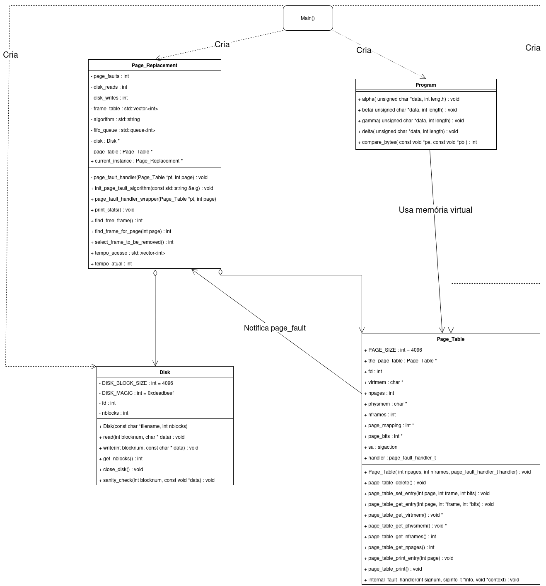

##### 3.4.2 Flow Diagram

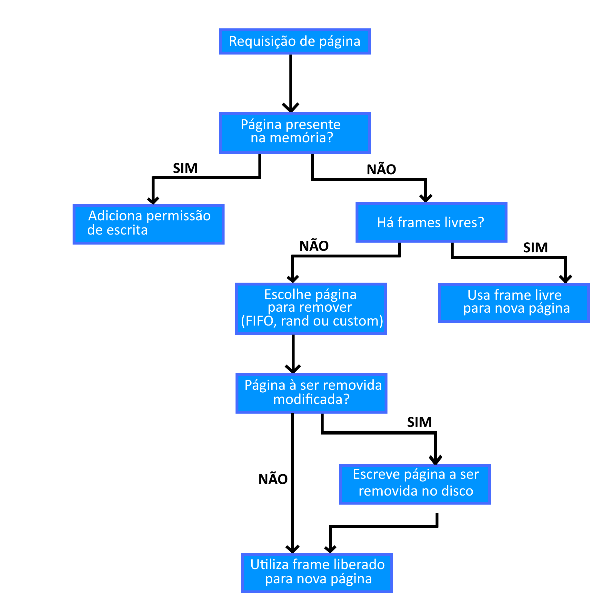

### 4. Page Replacement Algorithms

#### 4.1. RANDOM

Seleciona aleatoriamente um frame para substituição. A implementação utiliza `std::rand() % frame_table.size()` para escolher o frame a ser desocupado, tornando o processo não determinístico em relação ao histórico de acessos.

#### 4.2 FIFO (First-In, First-Out)

Maintains a queue (`std::queue`) of the pages currently loaded in memory. When a replacement is needed, the page at the front of the queue (i.e., the one that was loaded **earliest**) is removed.

#### 4.3 CUSTOM

* As a custom page replacement algorithm, the group implemented a version of **LRU (Least Recently Used)**.

* At the initialization of the `Page_Replacement` class, two attributes are defined:

  1. A vector of integers `tempo_acesso`, which stores the **timestamp of the last access** for each frame.
  2. An integer `tempo_atual`, which is incremented every time a page fault is handled, functioning as a logical clock.

* Inside the `Page_Replacement::select_frame_to_be_removed` method, if the selected algorithm is `custom`, the following steps are applied:

  1. Set `min_time` to the largest possible integer.
  2. Initialize `frame_to_remove` to -1 (no frame selected yet).
  3. For each frame:
     * If the frame’s last access time is less than `min_time`, update `frame_to_remove` to that index.
  4. Return the index of the frame to be removed.

* The access time of a frame is updated **every time the page it holds is referenced**, either due to a page fault that loads the data or a protection fault that grants write permission.

#### 4.3.1 Comparisons

##### Rand

* The `rand` algorithm selects a frame to remove **at random**, which can lead to a **high rate of page faults**, especially in scenarios where **recently accessed pages are needed again**.
* In such cases, the `custom` algorithm tends to perform better than `rand` because it **prioritizes evicting pages that haven't been accessed recently**, while `rand` does not consider access history at all.

##### FIFO

* The `fifo` algorithm removes the **oldest loaded page**, which can also lead to a high page fault rate if recently accessed pages are evicted (**Belady’s anomaly**).
* The `custom` (**LRU**) algorithm may outperform `fifo` in scenarios where **recently accessed pages are reused**, as it avoids evicting pages that were accessed recently.
* Additionally, in situations with a **high page access rate**, `custom` may be more efficient than `fifo`, since `fifo` ignores access history, while `custom` favors retaining recently used pages. This is especially noticeable in **read-intensive scenarios**.

##### Diagram for Understanding

* The following graphical diagram was created to better illustrate how the `custom` algorithm (LRU) operates:

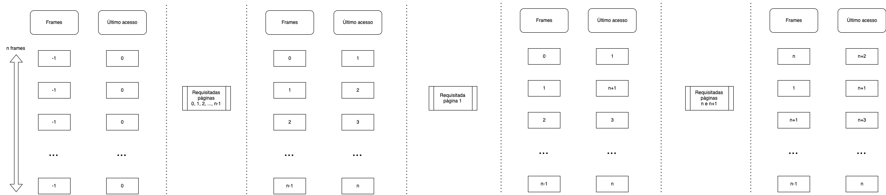

First, two vectors were allocated to represent the `frame` and the `tempo_acesso` (access time) for each frame (`n`). The frame vector was initialized with all values set to -1, indicating that no frame was occupied. The `tempo_acesso` vector was initialized with all values set to 0, indicating that no frame had been accessed yet.

Next, pages `0`, `1`, `2`, ..., `n-1` were requested, occupying all available frames. With each request, the current time was incremented, and the access time of the corresponding frame was updated to reflect the current time.

After that, page `1` was requested again, updating its frame’s access time to the new current time (`n+1`).

Then, pages `n` and `n+1` were requested. Since no free frames were available, the `custom` algorithm selected the frame with the **oldest access time** (i.e., the least recently used). In this case, the frame holding page `0` was selected and replaced with page `n`. Similarly, the frame holding page `2` was replaced with page `n+1`, as it now had the smallest access time among the remaining frames.

This example demonstrates how the `custom` (LRU) algorithm **always removes the page that has not been accessed for the longest time**, which tends to reduce the number of page faults in scenarios where recently accessed pages are likely to be used again soon.

It becomes evident that, in this case, the `custom` algorithm outperforms both `rand` and `fifo`, as it **prioritizes keeping recently used pages in memory**. Had `fifo` been used, page `1` would have been removed at time `n+3`, even though it was recently accessed. `rand`, on the other hand, might have removed **any page at random**, ignoring access history entirely.

### 5. Results and Analysis

The following section presents, for each program (`alpha`, `beta`, `gamma`, and `delta`), a series of graphs showing the values of `page faults`, `disk reads`, and `disk writes` for each page replacement algorithm (`rand`, `fifo`, and `custom`).

To contextualize the results, it is important to understand the memory access pattern of each test program, as defined in the project:

* **Alpha:** Performs sequential accesses in large memory blocks.
* **Beta:** Sorts a large data array, resulting in complex and not fully sequential access.
* **Gamma:** Repeatedly accesses two large vectors in a cyclic manner, exhibiting strong temporal locality at a macro scale.
* **Delta:** Performs a large number of data swaps in random positions, simulating a worst-case scenario with no locality.

The following analysis details the behavior of each page replacement algorithm (RAND, FIFO, and CUSTOM) for each test program, based on the collected data for page faults, disk reads, and disk writes.

The tests were executed using the following structure:

```bash
./virtmem <list(range(3, 100))> 100 <["rand", "fifo", "custom"]> <["alpha", "beta", "gamma", "delta"]>
```

> The command above mixes Python and Bash, where `list(range(3, 100))` generates a list of frame counts from 3 to 99, and all combinations of algorithms and programs are tested.

In other words, for each program (`alpha`, `beta`, `gamma`, `delta`), the page replacement algorithms (`rand`, `fifo`, and `custom`) were tested with the number of frames ranging from 3 to 100, while keeping the number of pages fixed at 100. The results were collected and organized into graphs for analysis.

> It is worth noting that all randomness-based tests were executed with the random seed `srand(0)` to ensure reproducibility of the results.

#### 5.1 Testing each program

##### 5.1.1 Alpha

The `alpha` program accesses memory sequentially in blocks. This characteristic leads to distinct behavior among the page replacement algorithms.

* **Page Faults:** Both FIFO and CUSTOM algorithms experience a **sharp drop** in page faults to a low, constant value once the number of frames is sufficient to hold the program’s `chunksize` (approximately 10 frames). In contrast, the RAND algorithm shows a **gradual but consistently higher** reduction in faults compared to the other two after this threshold.
* **Disk Reads and Writes:** The pattern of disk reads and writes mirrors the behavior of page faults. There is a steep decline for FIFO and CUSTOM, which stabilize at a low level, while RAND decreases more slowly.

The **identical performance** of FIFO and CUSTOM (LRU) suggests that `alpha`'s sequential access pattern does **not offer opportunities for LRU to leverage temporal locality**. The least recently used page is always the one that was loaded first, making the two algorithms effectively equivalent in this scenario.


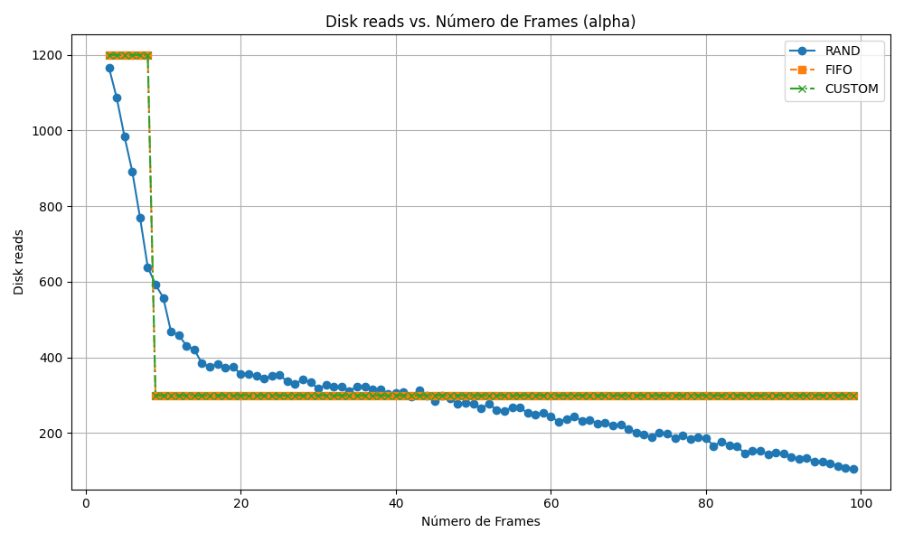


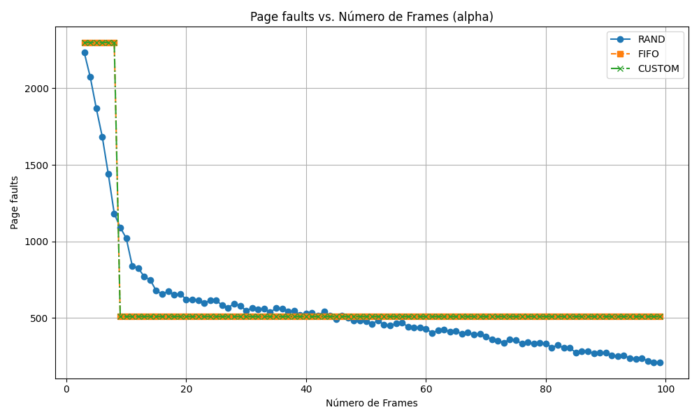

##### 5.1.2 Beta

The `beta` program performs a sorting operation (`qsort`), resulting in a **complex and less predictable memory access pattern**.

* **Page Faults:** All algorithms exhibit a **decreasing trend** in page faults as more frames become available. FIFO and CUSTOM once again show **identical behavior**, with a "stair-step" decline—where performance plateaus for a range of frame counts before dropping again. RAND follows the overall trend, but in a more **irregular** manner.
* **Disk Reads and Writes:** The graphs for disk operations mirror the behavior of the page fault graphs, showing the same stair-step decline for FIFO and CUSTOM.

This **stepwise pattern** suggests that performance improves in **discrete jumps**, likely when the number of frames becomes sufficient to hold entire data partitions during sorting. The lack of advantage of CUSTOM over FIFO implies that, although access is not purely sequential, the page reference pattern is **so scattered** that temporal locality is not leveraged effectively.

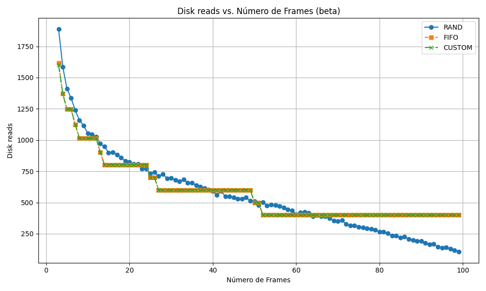

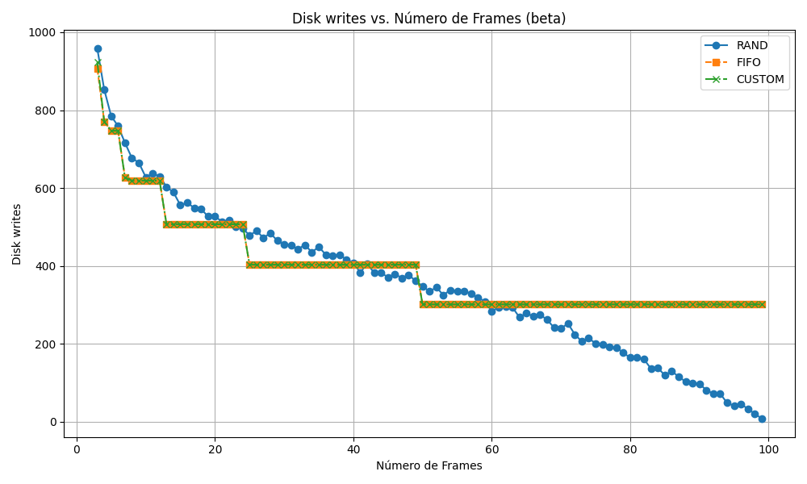

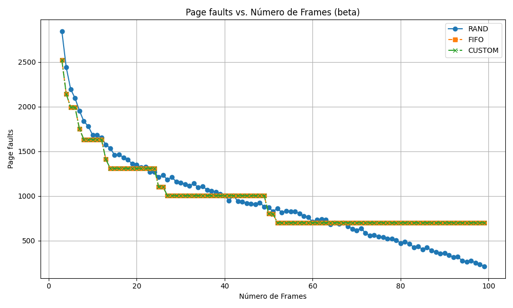

##### 5.1.3 Gamma

The `gamma` program repeatedly computes the dot product between two large vectors.

**Page Faults, Disk Reads, and Disk Writes:** The graphs show that both the FIFO and CUSTOM algorithms exhibit **identical and constant performance**, regardless of the number of frames. In contrast, the RAND algorithm consistently improves as more frames are added.

The constant performance of FIFO and CUSTOM is a classic example of **thrashing**. Adding more frames does not improve the situation because the systematic replacement pattern remains unchanged. RAND, due to its **random nature**, is able to break this cycle and benefit from the increasing number of frames.

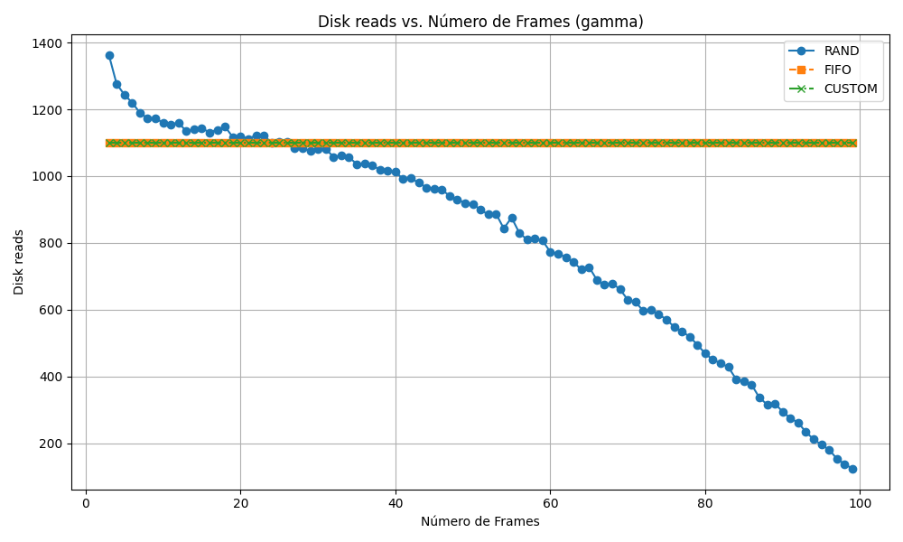

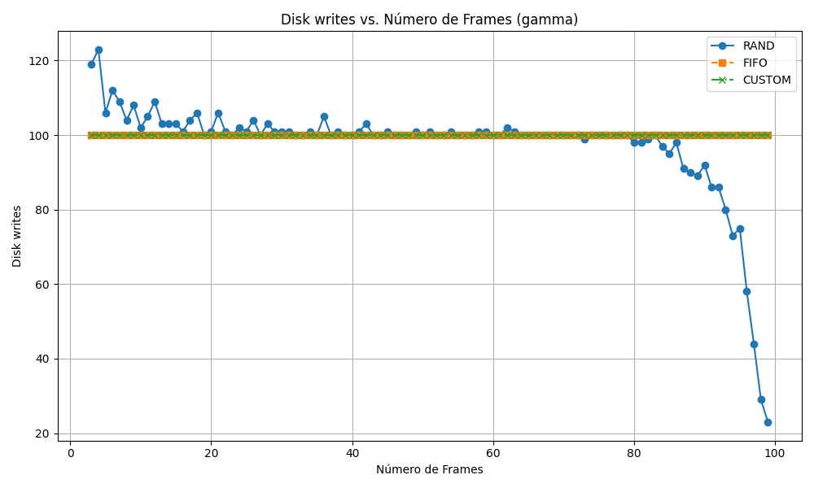

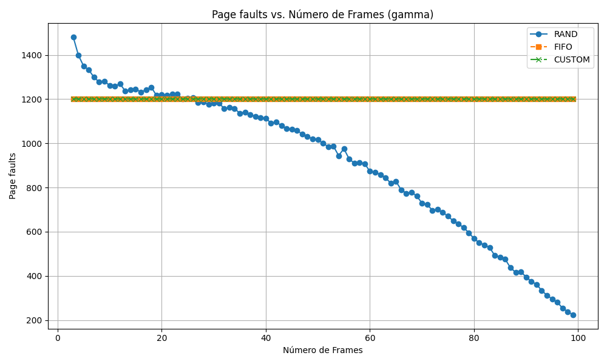

##### 5.1.4 Delta

The `delta` program performs a large number of swaps at random memory locations, simulating a **worst-case scenario** with little to no locality.

* **Page Faults, Disk Reads, and Disk Writes:** Across all three graphs, all algorithms (RAND, FIFO, and CUSTOM) show **nearly identical performance**. The curves display an almost perfectly **linear decrease** as the number of frames increases. The only minor exception is that RAND results in slightly more disk reads with very few frames but quickly converges with the others.

This behavior demonstrates that, **in the absence of locality**, the choice of page replacement algorithm becomes irrelevant. The probability of accessing any given page is essentially the same, so the decision of which "victim" page to evict (whether the oldest, the least recently used, or a random one) has no significant impact on the final outcome. The linear decrease is expected: with more frames, the likelihood that a randomly accessed page is already in memory increases proportionally, thereby **reducing page faults linearly**.


#### 5.2 Analysis of the Results

The following analysis interprets the graphs obtained for each program, highlighting observed patterns, explaining similarities between the algorithms, and relating the observed behavior to concepts such as locality and page replacement strategies.

##### 5.2.1 Similarities Between `fifo` and `custom`

In many cases, the `fifo` and `custom` algorithms demonstrated **identical performance**. This convergence mainly occurs when:

1. The access pattern does not reuse pages before they are replaced;
2. The number of available frames is insufficient to keep active pages in memory for a meaningful period.

In such scenarios, considering access history offers no practical advantage, as both algorithms behave similarly:

* They insert the new page into the first available free frame;
* When frames are full, they remove the “oldest”:

  * `fifo` removes the page that was loaded first;
  * `custom` removes the page that was least recently used.
* If the access pattern does not reuse pages before their replacement, the removal logic — whether based on arrival time (FIFO) or last access time (LRU) — leads to the same outcome.

In other words, the programs `alpha`, `beta`, `gamma`, and `delta` do not exhibit reuse before replacement, do not benefit from temporal locality, and therefore **do not take advantage of a more sophisticated algorithm** like `custom`.

As a result, when no page is reused between its load and its eviction, both strategies converge to the same behavior.

##### 5.2.2 General Downward Trend

The graphs for `disk reads`, `disk writes`, and `page faults` generally exhibit a **downward trend** as the number of frames increases. This behavior is expected because:

* The decrease in page faults, disk reads, and disk writes is directly related to the number of available frames. With more frames, the system can retain more pages in memory, reducing the need for page replacements and, consequently, disk access.

The decline is not always linear, as access patterns and program behaviors vary, but the **overall decreasing trend** remains consistent.


##### 5.2.3 Constant Behavior of `gamma` with `fifo` and `custom`

The constant number of page faults observed with `fifo` and `custom` in the `gamma` program indicates **cyclic replacement behavior**. This occurs because `gamma` repeatedly alternates between two large vectors in a cyclic fashion, generating a steady rate of page faults. This behavior is typical of scenarios that lead to **thrashing** — frequent page evictions followed by immediate reuse.

1. Since the vectors are accessed alternately, any frame allocated to one vector is soon replaced by a page from the other.
2. Both `fifo` and `custom` operate deterministically in this cycle, preventing performance improvements even as the number of frames increases.

This pattern does **not** occur with `rand`, because it randomly selects which page to evict during a page fault. As the number of available frames increases, `rand` benefits from a larger working set, leading to a **gradual decrease** in page faults, rather than a constant rate.


##### 5.2.4 Linear Behavior of `delta`

Regardless of the page replacement algorithm used, the `delta` program generally exhibits a linear downward trend (most clearly in `rand`) in disk reads, disk writes, and page faults. This is due to the program's highly random and scattered memory accesses, which offer very little reuse.

As the number of frames increases, more pages can be kept in memory — reducing the likelihood of page replacements.

In other words, the graphs tend to show a decreasing trend overall, although the patterns may not always be linear due to program behavior. However, because `delta` has extremely dispersed access, it represents the “worst-case” scenario and thus shows a consistently linear downward pattern.


##### 5.2.5 Execution time

It is worth noting that the execution time of the `delta` program is significantly higher than that of the other programs, due to its nature of performing random and scattered memory accesses. This results in a high number of page faults and, consequently, more disk reads and writes.

This can be observed in the following graph, which compares the execution time of the programs:

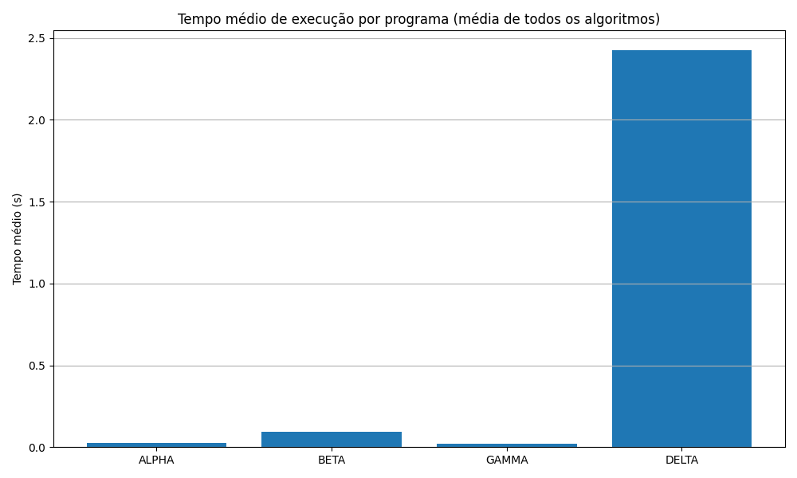

## Appendix

### Memory Leak

Throughout the system's implementation, continuous testing was carried out to detect potential memory leaks, using `AddressSanitizer` (`-fsanitize=address`). At the end of development, the system was executed with the command `./virtmem 10 10 rand alpha`, and no errors or memory leaks were detected, confirming that all dynamic allocations were properly handled.

Dynamic memory was correctly released using `delete[]` in the appropriate destructors or cleanup methods. The `Disk` object was explicitly deleted in `main.cpp`.

In summary, no memory leaks were found during system execution, and all memory allocations were correctly freed.

> In the first assignment, the `valgrind` tool was used to check for memory leaks. However, `valgrind` is not compatible with signal handling, which made it impossible to verify memory leaks during the execution of the system in the second assignment.

### Specific Results Expected

In the assignment brief, the expected results for each program when executed with 10 pages are provided. Below are the recorded return values for executions using 10 pages and 5 frames, with the `custom` algorithm applied to each program.

Programa | Número de páginas | Número de frames | Algoritmo | Page Faults | Disk Reads | Disk Writes | Resultado
---------|-------------------|------------------|-----------|-------------|------------|-------------|-----------
`alpha`  | 10                | 5                | custom    | 2030        | 1020       | 1010        | 5222400
`beta`   | 10                | 5                | custom    | 81          | 50         | 31          | 5232896
`gamma`  | 10                | 5                | custom    | 120         | 110        | 10          | 2220835000
`delta`  | 10                | 5                | custom    | 209853      | 104931     | 104922      | 5201920


## Conclusion

With the completion of this second assignment for the Operating Systems I course, the student authors conclude this phase of their journey in the Computer Science program. It is with great joy that we finalize this project and the course itself, confident that the knowledge gained will be of great value in the future.

We thank the course instructors for their time and patience.

Regarding the assignment, it allowed us to better understand the workings of demand-paged virtual memory, the implementation of page replacement algorithms, and the impact these algorithms have on system performance — in addition to gaining a clearer view of how a program’s memory access pattern can influence the efficiency of page replacement strategies. Completing this virtual memory system marks an important milestone in our academic development, reinforcing fundamental concepts of operating systems and C++ programming — previously seen only in theory during the first half of the course.

There is certainly room for improvements and optimizations, such as creating new program profiles and developing new custom page replacement algorithms. Nonetheless, the system we designed and delivered, in our view, meets the assignment’s requirements and demonstrates the knowledge we have acquired.
